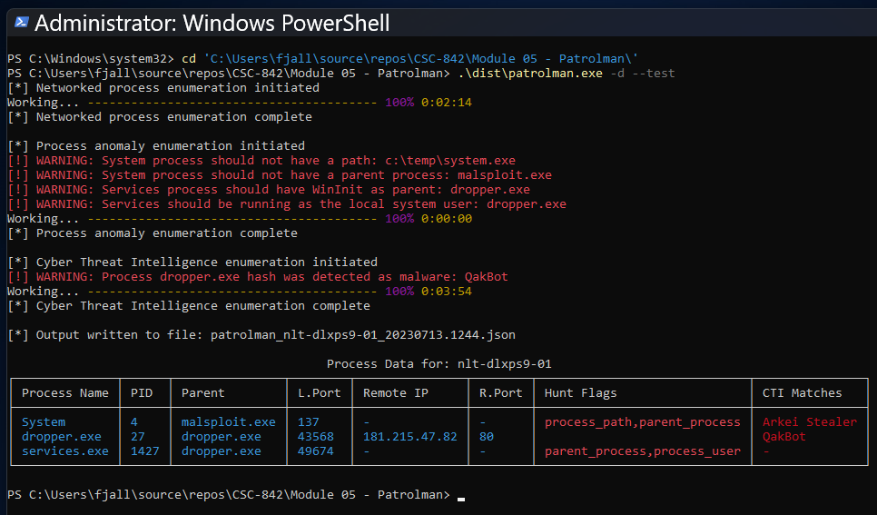

# Patrolman
[](https://github.com/jcole-sec/patrolman-rs/actions/workflows/secret-scan.yml)
```
    ____        __             __
   / __ \____ _/ /__________  / /___ ___  ____ _____
  / /_/ / __ `/ __/ ___/ __ \/ / __ `__ \/ __ `/ __ \
 / ____/ /_/ / /_/ /  / /_/ / / / / / / / /_/ / / / /
/_/    \__,_/\__/_/   \____/_/_/ /_/ /_/\__,_/_/ /_/

    Windows Security Analysis Tool v2.1.0
    Hunt Evil • CTI Enrichment • Network Forensics
```

## What?

Patrolman enumerates running processes and identifies associated data attributes, including execution path and arguments, binary hash, and network connection details. 

Patrolman then attempts to identify malicious indicators by analyzing behavioral abnormalities and checking observable indicators for Cyber Threat Intelligence (CTI) pattern matches.

Patrolman is an upgrade to the netproc (Windows Networked Process Enumerator) tool that adds in the capability to detect malicious process patterns and network traffic.

The name Patrolman is derived from "patrolmen", an anagram of malnetproc (mal + netproc).

## Why?

This tool is primarily intended for security investigation use cases.

Some example use cases include:
- Configure as a detective tool to run and log periodically via a scheduler.
- Run interactively during a Windows DFIR investigation to identify malicious process execution.
- Use during an image build process to identify native baseline behaviors.

## How?

Patrolman is written in **Rust** for performance, safety, and reliability. It uses the `sysinfo` crate for process enumeration and native Windows APIs for network connection details.

These data attributes include:
- Process name and ID
- Process sockets (local and remote IP/ports, protocol)
- Process network communication type (PUBLIC, PRIVATE, or LOOPBACK)
- Process path and execution parameters (command line)
- Process SHA-256 hash
- Process user account
- Parent process name and ID

Patrolman uses this data to run **Hunt Evil** detection and **CTI enrichment** functions.

### Hunt Evil Detection

The Hunt Evil function leverages the detection logic outlined in the [SANS DFIR "Find Evil - Know Normal" poster](https://www.sans.org/posters/hunt-evil/). It validates critical Windows processes against known-good baselines:

| Process | Expected Path | Expected Parent | Expected User |
|---------|---------------|-----------------|---------------|
| System | N/A | None (PID 0) | SYSTEM |
| smss.exe | System32 | System | SYSTEM |
| csrss.exe | System32 | Orphan | SYSTEM |
| wininit.exe | System32 | Orphan | SYSTEM |
| services.exe | System32 | wininit.exe | SYSTEM |
| svchost.exe | System32 | services.exe | Varies |
| lsass.exe | System32 | wininit.exe | SYSTEM |
| lsaiso.exe | System32 | wininit.exe | SYSTEM |
| winlogon.exe | System32 | Orphan | SYSTEM |
| explorer.exe | %SystemRoot% | Orphan | User |
| RuntimeBroker.exe | System32 | svchost.exe | User |
| taskhostw.exe | System32 | svchost.exe | Varies |

Anomalies are flagged when processes deviate from these baselines (wrong path, wrong parent, wrong user, etc.).

### CTI Enrichment

The CTI enrichment function checks processes communicating with public remote IPs:

- **RIPE Stat API**: Returns IP geolocation, network name, and country of registration (no API key required)
- **ThreatFox API**: Returns malware classification, threat confidence, and IOC reputation (requires free API key)
- **MalwareBazaar API**: Returns malware signature, file type, and tags for known malicious hashes (requires free API key)

Hash lookups are performed for all processes regardless of network activity.

### Output Formats

Tool output defaults to JSON, but also supports TSV and interactive console display with colored threat highlighting.

## Future Improvements

- [ ] Allow service or daemon mode for continual execution and logging
- [ ] Expand detective logic for process patterns (including common LOLBins)
- [ ] Publish to Windows Event Log as a dedicated application
- [ ] Add detective logic for Linux and macOS abnormal process patterns
- [ ] Add VirusTotal API integration for hash lookups

## Install

### Prerequisites

- **Rust toolchain** (1.70+): Install from [rust-lang.org](https://www.rust-lang.org/tools/install)
- **Windows SDK** (for Windows API access)
- **Administrator privileges** (required for full process enumeration)

### Build from Source

```powershell
# Clone or navigate to the repository
cd patrolman

# Build release binary (includes embedded icon and metadata)
cargo build --release

# Binary will be at target\release\patrolman.exe
```

### Development Build

```powershell
# Build and run with debug output
cargo run -- --debug --display

# Run tests
cargo test

# Check code
cargo clippy
```

## Project Structure

```
patrolman/
├── src/
│   ├── main.rs           # Entry point & orchestration
│   ├── args.rs           # CLI argument parsing (clap)
│   ├── config.rs         # Configuration file handling
│   ├── types.rs          # ProcessData struct & constants
│   ├── process.rs        # Process enumeration & hashing
│   ├── huntevil.rs       # SANS Hunt Evil anomaly detection
│   ├── cti_enrichment.rs # ThreatFox, MalwareBazaar, RIPE APIs
│   └── display.rs        # Console output & formatting
├── assets/
│   └── Users-Police-icon.ico  # Application icon
├── build.rs              # Windows resource embedding
├── Cargo.toml            # Dependencies & metadata
└── patrolman.conf        # Runtime configuration
```

### Configure ThreatFox API Key (Optional)

To enable full Cyber Threat Intelligence (CTI) enrichment, register for a free API key from [abuse.ch](https://abuse.ch/register/). This unlocks ThreatFox and MalwareBazaar lookups.

#### Configuration Methods

**Method 1: Configuration File (Recommended)**

Edit `patrolman.conf` in the application directory:
```ini
[api]
threatfox_api_key=your-api-key-here
```

**Method 2: Environment Variable**

Set the environment variable before running Patrolman:

```powershell
# PowerShell (temporary)
$env:THREATFOX_API_KEY = "your-api-key-here"
.\patrolman.exe --display

# PowerShell (permanent - user level)
[Environment]::SetEnvironmentVariable("THREATFOX_API_KEY", "your-api-key-here", "User")
```

#### Priority Order

Patrolman checks for API keys in this order:
1. **Environment variable** (`THREATFOX_API_KEY`)
2. **Configuration file** (`patrolman.conf`)
3. **None** - Running in limited mode (RIPE lookups only)

**Note**: Without an API key, RIPE lookups still work (public geolocation data), but ThreatFox/MalwareBazaar checks will be skipped.


## Usage

Run as administrator (required for additional data, such as user enumeration for privileged processes).

```powershell
# Basic usage (JSON output by default)
.\patrolman.exe

# Display results in console with threat highlighting
.\patrolman.exe --display

# Export to TSV format
.\patrolman.exe --tsv

# Filter to public IP connections only
.\patrolman.exe --public --display

# Include synthetic test data for validation
.\patrolman.exe --test --display

# Enable debug logging
.\patrolman.exe --debug

# Combine options
.\patrolman.exe --display --tsv --public --debug
```

### Command-Line Options

```
Options:
      --json       Enable JSON output (default: true)
      --tsv        Enable TSV (tab-separated) output
  -d, --display    Enable console display output
  -p, --public     Filter results to public IP addresses only
      --debug      Enable debug logging
      --test       Insert synthetic test data for validation
  -h, --help       Print help
  -V, --version    Print version
```

### Sample Console Output

```
    ____        __             __
   / __ \____ _/ /__________  / /___ ___  ____ _____
  / /_/ / __ `/ __/ ___/ __ \/ / __ `__ \/ __ `/ __ \
 / ____/ /_/ / /_/ /  / /_/ / / / / / / / /_/ / / / /
/_/    \__,_/\__/_/   \____/_/_/ /_/ /_/\__,_/_/ /_/

    🛡️  Windows Security Analysis Tool v0.2.0

▶ Networked process enumeration
✓ Networked process enumeration (156 items)
▶ Process anomaly detection (Hunt Evil)
✓ Process anomaly detection (12 items)
▶ Cyber Threat Intelligence enrichment
✓ CTI enrichment (ThreatFox + MalwareBazaar + RIPE) (0 items)

╔══════════════════════════════════════════════════════════════════════════════╗
║                           📊 SCAN SUMMARY                                    ║
╠══════════════════════════════════════════════════════════════════════════════╣
║ 🖥️  HOSTNAME              ⏱️  2026-01-31 16:49:22                            ║
╠══════════════════════════════════════════════════════════════════════════════╣
║ 📋 Processes: 156          🚩 Hunt Evil Flags: 12                            ║
║ 🌐 Public IPs: 89          🔐 Unique Hashes: 42                              ║
║ ☠️  Threat Hits: 0         🦠 MalwareBazaar: 0                               ║
╚══════════════════════════════════════════════════════════════════════════════╝
```


## Architecture & Performance

### Data Pipeline

```
┌─────────────────┐    ┌─────────────────┐    ┌─────────────────┐    ┌─────────────────┐
│   Enumeration   │──▶│   Hunt Evil     │───▶│ CTI Enrichment  │──▶│     Output      │
│                 │    │                 │    │                 │    │                 │
│ • sysinfo crate │    │ • SANS baselines│    │ • ThreatFox     │    │ • JSON/TSV      │
│ • Windows APIs  │    │ • Path checks   │    │ • MalwareBazaar │    │ • Console table │
│ • SHA-256 hash  │    │ • Parent checks │    │ • RIPE Stat     │    │ • Threat panel  │
└─────────────────┘    └─────────────────┘    └─────────────────┘    └─────────────────┘
```

### Performance Optimizations

Patrolman v0.2.0 includes production-grade optimizations:

| Optimization | Description |
|--------------|-------------|
| **Parallel Hashing** | Rayon-based parallel SHA-256 computation across CPU cores |
| **Concurrent API Calls** | `tokio::join!` for simultaneous ThreatFox/MalwareBazaar/RIPE lookups |
| **Hash Deduplication** | Skip redundant API lookups for processes sharing the same binary |
| **IP Deduplication** | Skip redundant RIPE/ThreatFox lookups for repeated remote IPs |
| **Static Flag Messages** | Zero-allocation anomaly detection using `&'static str` constants |
| **Pre-computed Context** | Lowercase path/name computed once per process, not per check |
| **Interned Strings** | `Arc<str>` for common values (protocol, IP type) reduces memory |
| **Session Pooling** | HTTP connection reuse across API calls |
| **Dynamic Table Width** | Console output adapts to terminal width |

### Hunt Evil Detection

Uses parallel iteration (`rayon`) with pre-computed process context:

```rust
process_list
    .into_par_iter()
    .map(|mut pdata| {
        pdata.hunt_flags = check_process(&pdata);
        pdata
    })
    .collect()
```

Validates 12 critical Windows processes against SANS "Find Evil - Know Normal" baselines.


## Demonstration

Command with display output:
```powershell
.\patrolman.exe --display --test
```



Video demonstration: https://youtu.be/KJUr_yH_ooA


## Dependencies

| Crate | Purpose |
|-------|---------|
| `sysinfo` | Cross-platform process enumeration |
| `windows` | Native Windows API access |
| `reqwest` | HTTP client for API calls |
| `tokio` | Async runtime for concurrent I/O |
| `rayon` | Data parallelism for CPU-bound tasks |
| `serde` / `serde_json` | JSON serialization |
| `clap` | CLI argument parsing |
| `sha2` | SHA-256 hashing |
| `colored` | Terminal colors |
| `comfy-table` | Console table formatting |
| `chrono` | Timestamp handling |
| `log` / `env_logger` | Structured logging |


## License

MIT License - See LICENSE file for details.

For support, contact https://github.com/jcole-sec
